# X3 Business Card

## Technical Design Document

**Status:** Proposed
**Version:** 1.0
**Application:** SvelteKit
**Deployment:** Docker
**Primary device:** Xteink X3 running CrossPoint Reader
**Target screen:** 528 × 792 pixels
**Primary use case:** Generate and transfer a minimalistic digital business/presentation card to an Xteink X3 over the local network.

---

# 1. Overview

X3 Business Card is a lightweight web application for creating a minimalistic presentation/business card optimized for the Xteink X3 e-ink display.

The application allows the user to:

1. Enter personal/professional information.
2. Select portrait or landscape orientation.
3. See a live preview rendered as an e-ink device.
4. Generate an X3-compatible bitmap.
5. Detect whether a CrossPoint-powered X3 is reachable on the local network.
6. Send the generated image directly to the X3.
7. Download the generated image when direct transfer is unavailable.

The application is designed primarily for use from a **mobile phone**, while remaining fully functional on desktop.

The application should feel visually similar to an e-ink device rather than a conventional SaaS/web application.

---

# 2. Goals

## 2.1 Primary goals

* Generate professional-looking e-ink business cards.
* Support portrait and landscape layouts.
* Optimize output specifically for the X3's 528×792 display.
* Provide real-time preview.
* Work comfortably on mobile browsers.
* Detect CrossPoint devices on the local network.
* Upload generated images directly to CrossPoint.
* Provide a fallback download option.
* Require no account.
* Store no personal information on a remote server by default.
* Run as a Docker container.
* Keep the application lightweight and self-hostable.

## 2.2 Secondary goals

* Allow multiple visual templates.
* Allow QR codes.
* Allow optional profile/company logos.
* Allow optional social/contact information.
* Remember the user's card locally in the browser.
* Support future X4 support.
* Support future direct WebSocket transfer.
* Support future NFC configuration workflows.

---

# 3. Non-goals

The initial version will NOT:

* Modify CrossPoint firmware.
* Communicate with the X3 over USB.
* Implement an NFC writer.
* Host user profiles.
* Require authentication.
* Store generated business cards on a backend database.
* Implement a full graphic-design editor.
* Support arbitrary image manipulation.
* Depend on cloud APIs for image generation.

---

# 4. CrossPoint Integration

CrossPoint Reader provides the functionality required for direct X3 communication.

The CrossPoint web server runs on:

```text
HTTP:       port 80
WebSocket:  port 81
UDP:        port 8134
```

The device can normally be accessed through:

```text
http://crosspoint.local/
```

or through its IP address when mDNS is unavailable.

CrossPoint exposes:

```text
GET /api/status
```

which returns information including:

```json
{
  "version": "1.0.0",
  "ip": "192.168.1.100",
  "mode": "STA",
  "rssi": -45,
  "freeHeap": 123456,
  "uptime": 3600,
  "device": "X3"
}
```

The `device` field identifies whether the hardware is an `X3` or `X4`.

File uploads are supported through:

```text
POST /upload
```

using multipart form data:

```text
file=<binary>
path=/<destination>
```

CrossPoint also supports a WebSocket upload protocol on port 81.

---

# 5. High-Level Architecture

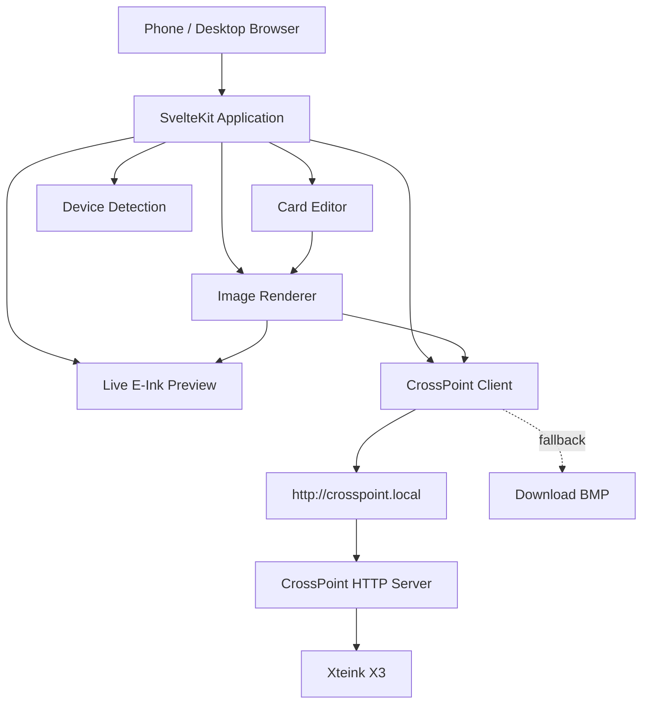

---

# 6. Technology Stack

## Frontend

* SvelteKit
* TypeScript
* Svelte 5
* CSS
* HTML Canvas
* QR code generation library
* Web APIs

## Backend

SvelteKit server routes should be kept minimal.

The application should primarily operate client-side.

Server-side functionality is reserved for:

* Health endpoint
* Optional proxy functionality
* Future device discovery
* Future configuration

## Container

Docker.

Recommended base:

```text
node:22-alpine
```

Build:

```text
npm run build
```

Runtime:

```text
node build
```

---

# 7. Why Rendering Should Be Client-Side

The generated card contains personal information.

Therefore the default architecture should be:

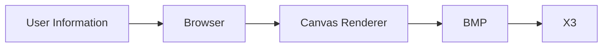

NOT:

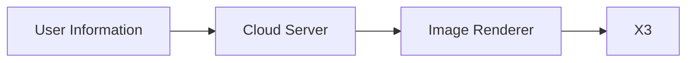

This avoids sending personal information to the application server.

The browser should generate the image locally.

---

# 8. X3 Display Specification

CrossPoint documentation specifies the X3 display resolution as:

```text
528 × 792 px
```

for best-resolution images.

The application therefore defines:

```ts
const X3_WIDTH = 528;
const X3_HEIGHT = 792;
```

Portrait:

```text
528 × 792
```

Landscape:

```text
792 × 528
```

The renderer must treat the physical display as:

```text
528 × 792
```

and rotate the generated bitmap when landscape mode is selected.

---

# 9. Image Format

The primary output format should be:

```text
BMP
```

CrossPoint supports BMP natively, and its documentation recommends uncompressed 24-bit BMP for custom images.

Therefore the first implementation should generate:

```text
Uncompressed BMP
24-bit RGB
```

The renderer should avoid:

* JPEG
* PNG as the primary transfer format
* Indexed-color BMP
* Compressed BMP

PNG can still be offered as a secondary download format for convenience.

---

# 10. Image Rendering Pipeline

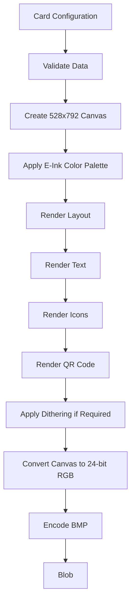

---

# 11. E-Ink Design System

The application itself should visually resemble an e-ink reader.

## Colors

Default palette:

```text
Paper:       #F5F5F0
Ink:         #111111
Dark Gray:   #444444
Mid Gray:    #777777
Light Gray:  #D8D8D3
```

The application UI should avoid bright colors.

Buttons should look like physical e-reader controls.

Example:

```text
┌────────────────────────────────────┐
│ X3 CARD                     ● X3   │
├────────────────────────────────────┤
│                                    │
│        ┌──────────────────┐        │
│        │                  │        │
│        │   CARD PREVIEW   │        │
│        │                  │        │
│        │                  │        │
│        └──────────────────┘        │
│                                    │
├────────────────────────────────────┤
│  PORTRAIT        LANDSCAPE         │
│                                    │
│  [ EDIT INFORMATION ]              │
│                                    │
│  [ SEND TO X3 ]                    │
│                                    │
└────────────────────────────────────┘
```

The UI should have:

* thin borders
* monochrome icons
* subtle shadows
* physical-button-like controls
* large touch targets
* no gradients
* no colorful cards
* no excessive rounded corners

---

# 12. Card Configuration Model

The main configuration object:

```ts
interface BusinessCard {
    orientation: "portrait" | "landscape";

    name: string;

    role?: string;

    company?: string;

    email?: string;

    phone?: string;

    website?: string;

    linkedin?: string;

    github?: string;

    location?: string;

    tagline?: string;

    qr?: {
        enabled: boolean;
        value: string;
        label?: string;
    };

    logo?: {
        enabled: boolean;
        dataUrl?: string;
    };

    template: "minimal" | "classic" | "modern";
}
```

---

# 13. Minimal Template

The default template should be extremely minimal.

Example portrait:

```text
┌──────────────────────────────┐
│                              │
│                              │
│  JORGE CHATO                 │
│  Senior Backend Engineer     │
│                              │
│  Mercari                     │
│                              │
│  ────────────────────────    │
│                              │
│  jorge@example.com           │
│  github.com/jorge            │
│  linkedin.com/in/jorge       │
│                              │
│                    ┌──────┐  │
│                    │ QR   │  │
│                    │      │  │
│                    └──────┘  │
│                              │
└──────────────────────────────┘
```

The actual design should be optimized for visual balance rather than simply filling the screen.

---

# 14. Landscape Template

Landscape:

```text
┌───────────────────────────────────────────┐
│                                           │
│  JORGE CHATO                  ┌────────┐  │
│  Senior Backend Engineer      │        │  │
│                               │   QR   │  │
│  Mercari                      │        │  │
│                               └────────┘  │
│  ─────────────────────────                │
│  jorge@example.com                        │
│  github.com/jorge                         │
│  linkedin.com/in/jorge                    │
│                                           │
└───────────────────────────────────────────┘
```

---

# 15. Typography

The renderer should use a small set of bundled fonts.

Recommended:

* Inter
* IBM Plex Sans
* Noto Sans

The application must bundle the fonts rather than depend on remote Google Fonts.

Recommended hierarchy:

```text
Name:
28–42 px

Role:
16–22 px

Company:
14–18 px

Contact:
12–16 px

Small metadata:
10–13 px
```

Actual sizes should be adjusted based on orientation and content length.

---

# 16. Text Fitting

The renderer MUST prevent text overflow.

For every text element:

```text
measureText()
    ↓
fits?
 ├── yes → render
 └── no
      ↓
reduce font size
      ↓
fits?
      ↓
minimum size reached?
      ↓
truncate / wrap
```

Names should never be truncated unless absolutely necessary.

For example:

```text
JORGE CHATO
```

should fit naturally.

Long URLs may be converted to a shorter visual representation:

```text
github.com/jorge
```

while the QR code retains the full URL.

---

# 17. QR Code

QR code generation should happen entirely in the browser.

The QR code should:

* use black and white only
* include sufficient quiet-zone padding
* have minimum physical size
* remain readable after e-ink rendering
* never be dithered

Recommended minimum:

```text
160 × 160 px
```

for portrait mode.

Landscape:

```text
140–180 px
```

depending on layout.

QR content can be:

```text
https://example.com
```

or a vCard.

Future version:

```text
BEGIN:VCARD
VERSION:3.0
FN:Jorge Chato
TITLE:Senior Backend Engineer
EMAIL:...
URL:...
END:VCARD
```

---

# 18. Live Preview

The preview must render the actual generated canvas rather than an approximate HTML representation.

This guarantees:

```text
Preview == Generated Image
```

The preview should simulate:

* e-ink background
* physical display aspect ratio
* grayscale
* subtle paper texture
* optional ghosting effect

The ghosting effect must be visual-only and MUST NOT be included in the final bitmap.

---

# 19. Device Detection

The application should periodically test:

```text
GET http://crosspoint.local/api/status
```

The expected result should contain:

```json
{
    "device": "X3"
}
```

If successful:

```text
● X3 connected
```

If unreachable:

```text
○ X3 not detected
```

If reachable but not an X3:

```text
● CrossPoint detected
  Device: X4
```

The UI should poll every:

```text
3000 ms
```

while the application is open.

Polling should stop when the page is hidden:

```ts
document.visibilityState === "hidden"
```

---

# 20. Device Detection State Machine

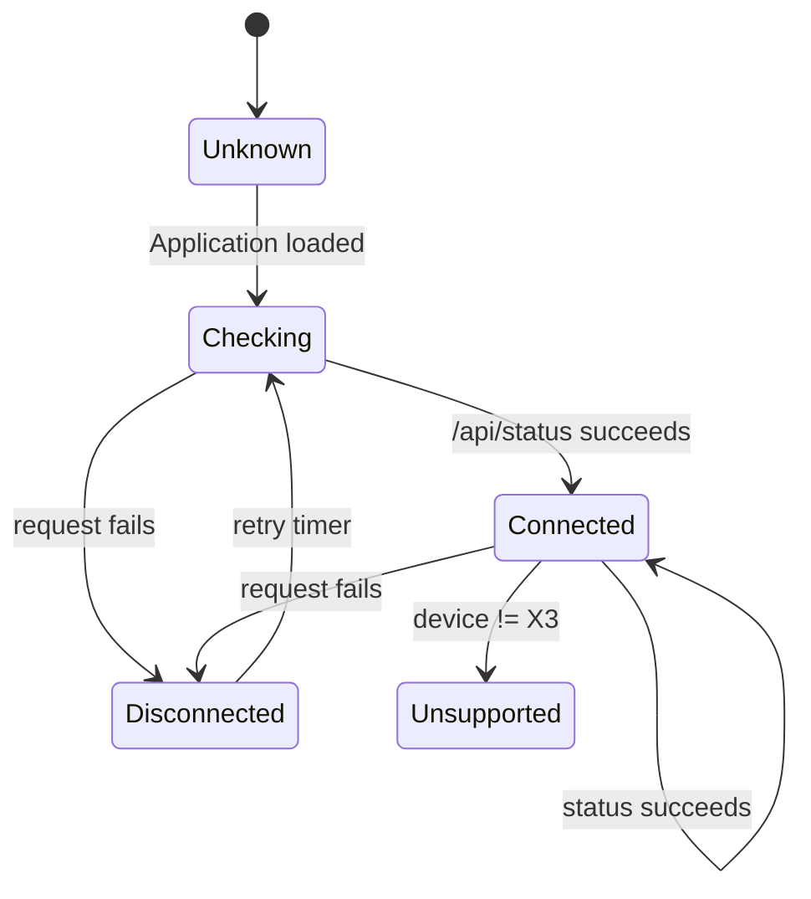

---

# 21. Important Browser Networking Constraint

The application runs in the browser while the X3 is on the local network.

Therefore the application must account for:

```text
Browser
   ↓
http://crosspoint.local
```

This is a browser-to-local-network request.

The CrossPoint server documentation currently does not describe an authentication mechanism, and the web server is intentionally available to devices on the same network while File Transfer mode is active.

The implementation MUST test CORS behavior.

If direct browser requests are blocked by CORS, implement a SvelteKit server-side proxy:

```text
Browser
   ↓
SvelteKit
   ↓
http://crosspoint.local
```

However, the proxy container must itself be able to resolve and reach `crosspoint.local`.

This is a critical deployment consideration.

---

# 22. Preferred Device Communication Strategy

Use HTTP multipart upload for the first implementation.

CrossPoint exposes:

```http
POST /upload?path=/
Content-Type: multipart/form-data
```

with:

```text
file=<BMP>
```

The documented example is:

```bash
curl -X POST \
  -F "file=@mybook.epub" \
  "http://crosspoint.local/upload?path=/Books"
```

Existing files with the same name are overwritten.

For the business card, use:

```text
/card.bmp
```

or:

```text
/business-card.bmp
```

---

# 23. Upload Flow

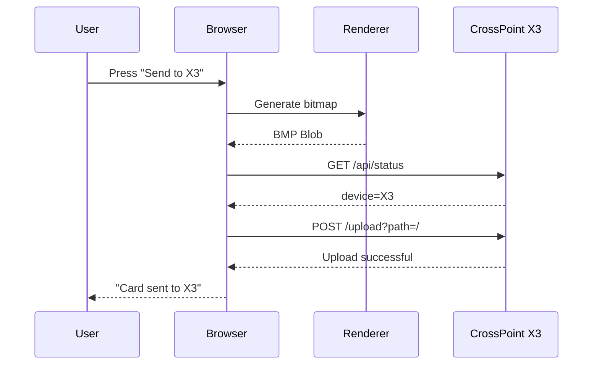

---

# 24. Filename

Use a deterministic filename:

```text
business-card.bmp
```

This allows the application to overwrite the previous version.

Optional future version:

```text
business-card-<timestamp>.bmp
```

but the default should be deterministic.

---

# 25. Upload Destination

The default destination:

```text
/
```

The application should initially upload:

```text
/business-card.bmp
```

Future versions may expose a configurable destination.

---

# 26. WebSocket Optimization

CrossPoint also provides a WebSocket upload server:

```text
ws://crosspoint.local:81/
```

Protocol:

```text
START:<filename>:<size>:<path>
```

Server responds:

```text
READY
```

Client sends binary chunks.

Server sends:

```text
PROGRESS:<received>:<total>
```

and finally:

```text
DONE
```

or:

```text
ERROR:<message>
```

The application should initially use HTTP because it is simpler.

WebSocket upload should be implemented behind an abstraction:

```ts
interface CrossPointTransport {
    upload(file: Blob, filename: string): Promise<void>;
}
```

Implementations:

```text
HttpUploadTransport
WebSocketUploadTransport
```

This makes switching transport later trivial.

---

# 27. CrossPoint Client

Create:

```text
src/lib/crosspoint/
```

Structure:

```text
crosspoint/
├── client.ts
├── types.ts
├── http.ts
├── websocket.ts
└── errors.ts
```

Example interface:

```ts
interface CrossPointClient {
    status(): Promise<DeviceStatus>;

    upload(
        file: Blob,
        filename: string,
        path?: string
    ): Promise<UploadResult>;
}
```

---

# 28. Device Status Type

```ts
interface DeviceStatus {
    version: string;
    ip: string;
    mode: "STA" | "AP" | string;
    rssi: number;
    freeHeap: number;
    uptime: number;
    device: "X3" | "X4" | string;
}
```

---

# 29. Upload Result

```ts
interface UploadResult {
    success: boolean;
    filename: string;
    response?: string;
}
```

---

# 30. Error Handling

Possible states:

### Device unavailable

```text
X3 not detected

Make sure:
• X3 is awake
• CrossPoint File Transfer is active
• Your phone is on the same Wi-Fi network
```

### Device found but wrong hardware

```text
CrossPoint detected, but this is an X4.
```

### Upload failed

```text
Unable to send card.

The X3 was detected but rejected the upload.
```

### Timeout

```text
The X3 did not respond.

Check that CrossPoint is still in File Transfer mode.
```

---

# 31. UX

The main screen should have three areas.

```text
┌──────────────────────────────────────┐
│ X3 BUSINESS CARD        ● CONNECTED  │
├──────────────────────────────────────┤
│                                      │
│              DEVICE                  │
│                                      │
│        ┌──────────────────┐          │
│        │                  │          │
│        │                  │          │
│        │      PREVIEW     │          │
│        │                  │          │
│        │                  │          │
│        └──────────────────┘          │
│                                      │
├──────────────────────────────────────┤
│                                      │
│ INFORMATION                          │
│                                      │
│ Name                                 │
│ [ Jorge Chato                     ]  │
│                                      │
│ Role                                 │
│ [ Senior Backend Engineer          ] │
│                                      │
│ Company                              │
│ [ Mercari                          ] │
│                                      │
│ Website                              │
│ [ https://...                      ] │
│                                      │
│ QR CODE                              │
│ [ enabled ]                          │
│                                      │
├──────────────────────────────────────┤
│                                      │
│ [ PORTRAIT ]  [ LANDSCAPE ]          │
│                                      │
│ [        SEND TO X3        ]          │
│                                      │
│ [      DOWNLOAD BMP       ]          │
│                                      │
└──────────────────────────────────────┘
```

---

# 32. Mobile UX

The mobile experience is the priority.

Requirements:

* responsive layout
* no horizontal scrolling
* inputs at least 44 px high
* buttons at least 44 px high
* preview automatically scales
* editor below preview
* sticky bottom action bar

Mobile layout:

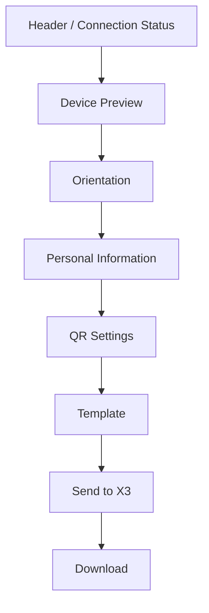

---

# 33. Desktop UX

Desktop should use a two-column layout:

```text
┌────────────────────────────────────────────────────┐
│ X3 BUSINESS CARD                    ● X3 CONNECTED │
├────────────────────────┬───────────────────────────┤
│                        │                           │
│                        │  INFORMATION              │
│       X3 PREVIEW       │                           │
│                        │  Name                     │
│                        │  Role                     │
│                        │  Company                  │
│                        │  Email                    │
│                        │  Website                  │
│                        │                           │
│                        │  ORIENTATION              │
│                        │  [Portrait] [Landscape]   │
│                        │                           │
│                        │  [ SEND TO X3 ]           │
│                        │                           │
└────────────────────────┴───────────────────────────┘
```

---

# 34. Local Persistence

Use:

```text
localStorage
```

for:

```text
businessCard
orientation
template
QR settings
```

No server-side persistence.

Example key:

```text
x3-business-card
```

The user should be able to clear/reset the card.

---

# 35. Privacy

Default architecture:

```text
Personal data
     ↓
Browser memory
     ↓
localStorage
```

No data should leave the browser except:

1. Upload to the X3.
2. Optional future analytics if explicitly enabled.

No analytics in V1.

---

# 36. Application Routes

Recommended:

```text
/
```

Main application.

```text
/about
```

Optional project information.

```text
/api/health
```

Docker health check.

No authentication.

---

# 37. SvelteKit Project Structure

```text
src/
├── lib/
│   ├── card/
│   │   ├── types.ts
│   │   ├── defaults.ts
│   │   ├── renderer.ts
│   │   ├── bmp.ts
│   │   ├── qr.ts
│   │   └── validation.ts
│   │
│   ├── crosspoint/
│   │   ├── client.ts
│   │   ├── http.ts
│   │   ├── websocket.ts
│   │   ├── types.ts
│   │   └── errors.ts
│   │
│   ├── storage/
│   │   └── local-card.ts
│   │
│   └── ui/
│       ├── DeviceStatus.svelte
│       ├── CardPreview.svelte
│       ├── CardForm.svelte
│       ├── OrientationSelector.svelte
│       └── SendButton.svelte
│
├── routes/
│   ├── +page.svelte
│   └── api/
│       └── health/
│           └── +server.ts
│
└── app.html
```

---

# 38. Renderer Architecture

The renderer should not depend on Svelte.

Use a pure TypeScript API:

```ts
renderBusinessCard(
    card: BusinessCard
): Promise<Blob>
```

Internally:

```text
BusinessCard
     ↓
Layout engine
     ↓
Canvas
     ↓
Bitmap
     ↓
BMP encoder
     ↓
Blob
```

This makes the renderer independently testable.

---

# 39. Renderer API

```ts
interface RenderOptions {
    width: number;
    height: number;
    orientation: "portrait" | "landscape";
    template: string;
}

async function renderBusinessCard(
    card: BusinessCard,
    options: RenderOptions
): Promise<Blob>;
```

---

# 40. BMP Encoder

Do not depend on browser-specific screenshot functionality.

Implement or use a small BMP encoder that produces:

```text
24-bit
uncompressed
BMP
```

The encoder should be unit tested against known BMP headers.

Required header:

```text
BM
```

The resulting file should be readable by standard image software.

---

# 41. Dithering

Dithering should be optional.

Default:

```text
No dithering
```

because the business-card design is intentionally minimalist.

Optional:

```text
Floyd-Steinberg
```

for:

* logos
* photographs
* gray graphics

Text and QR codes must remain pure black/white.

---

# 42. Template System

Templates should be data-driven.

```ts
interface CardTemplate {
    id: string;

    name: string;

    render(
        context: RenderContext
    ): void;
}
```

V1:

```text
minimal
```

V1.1:

```text
classic
modern
```

---

# 43. Orientation Handling

Portrait:

```text
528 × 792
```

Landscape:

```text
792 × 528
```

The renderer must not simply stretch the portrait layout.

Each orientation gets its own layout rules.

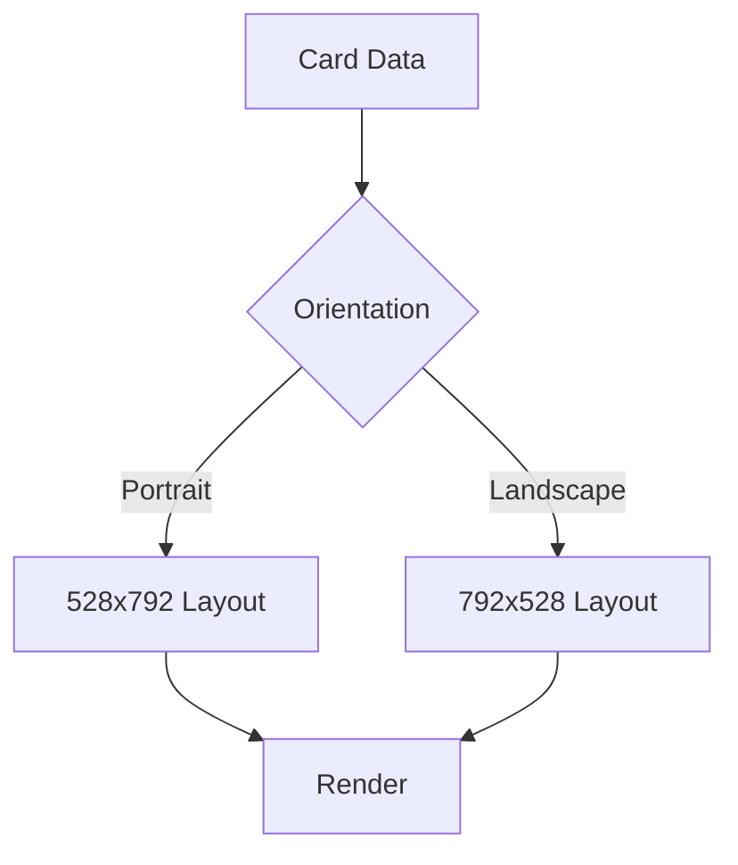

---

# 44. Connection Detection Strategy

On application load:

```text
1. GET /api/status
2. timeout = 1500ms
3. validate response
4. check device === "X3"
5. display status
```

Retry:

```text
every 3 seconds
```

Manual:

```text
[Check Again]
```

---

# 45. mDNS vs IP

Primary:

```text
http://crosspoint.local
```

Fallback:

```text
http://<device-ip>
```

CrossPoint itself displays the direct IP and normally advertises the mDNS hostname `crosspoint.local`.

V1 UI should provide an optional:

```text
X3 address

[ http://crosspoint.local ]
```

Advanced users can replace it with:

```text
http://192.168.1.100
```

The application should remember this value locally.

---

# 46. Device Configuration

Settings:

```ts
interface DeviceConfig {
    baseUrl: string;
    transport: "http" | "websocket";
    uploadPath: string;
}
```

Defaults:

```ts
{
    baseUrl: "http://crosspoint.local",
    transport: "http",
    uploadPath: "/"
}
```

---

# 47. Security Considerations

CrossPoint's HTTP server does not use authentication and is intended for local-network operation.

Therefore:

* Never expose the application as an internet-facing CrossPoint proxy.
* Do not proxy arbitrary URLs.
* Do not allow arbitrary CrossPoint addresses from a remote server.
* Validate device URLs.
* Prefer browser-direct communication.
* Do not store device credentials because none are required.
* Display a warning when using a non-local HTTP address.

---

# 48. SSR Considerations

SvelteKit SSR must not attempt to access:

```text
window
document
navigator
localStorage
Canvas
```

during server rendering.

Browser-only functionality must be guarded with:

```ts
import { browser } from "$app/environment";
```

Example:

```ts
if (browser) {
    // canvas / localStorage / CrossPoint detection
}
```

---

# 49. Docker

Dockerfile:

```dockerfile
FROM node:22-alpine AS builder

WORKDIR /app

COPY package*.json ./
RUN npm ci

COPY . .

RUN npm run check
RUN npm run build


FROM node:22-alpine AS runner

WORKDIR /app

ENV NODE_ENV=production

COPY --from=builder /app/build ./build
COPY --from=builder /app/package*.json ./

RUN npm ci --omit=dev

EXPOSE 3000

CMD ["node", "build"]
```

---

# 50. Docker Compose

```yaml
services:
  x3-business-card:
    build: .
    container_name: x3-business-card
    restart: unless-stopped
    ports:
      - "3000:3000"
    environment:
      - NODE_ENV=production
      - ORIGIN=http://localhost:3000
```

---

# 51. Local Deployment

```bash
docker compose up -d
```

Application:

```text
http://localhost:3000
```

---

# 52. Home Network Deployment

Example:

```text
Phone
  │
  │ Wi-Fi
  ▼
Router
  │
  ├── X3
  │     └── crosspoint.local
  │
  └── Docker host
        └── x3-business-card:3000
```

Important:

The Docker host and the X3 must be reachable from the user's phone/network.

---

# 53. Docker Networking Consideration

If using browser-direct requests:

```text
Phone → X3
```

Docker networking is irrelevant to the upload.

This is preferred.

If using a SvelteKit proxy:

```text
Phone → Docker → X3
```

then the Docker container must resolve:

```text
crosspoint.local
```

or otherwise access the X3 IP.

Therefore the proxy should be considered an optional fallback, not the default architecture.

---

# 54. Send Button State Machine

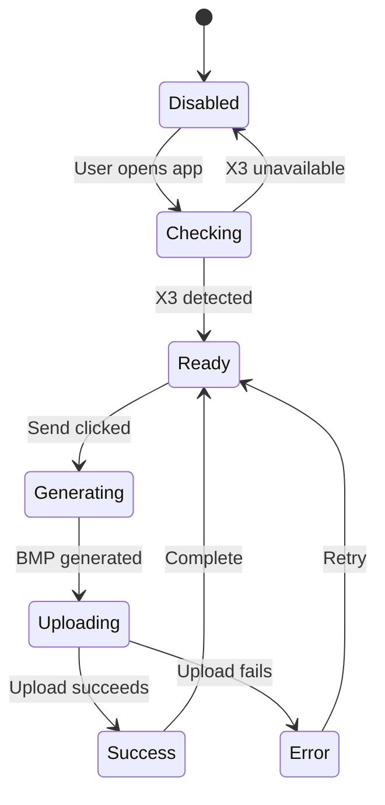

---

# 55. User Feedback

While generating:

```text
Preparing card…
```

Uploading:

```text
Sending to X3…
```

Success:

```text
✓ Card sent to X3
```

Failure:

```text
× Could not send to X3
```

Never leave the user wondering whether the device actually received the image.

---

# 56. Automatic Refresh on X3

Uploading a BMP only transfers the file to the device's storage.

The application should NOT assume that uploading a file automatically changes the current e-ink screen.

The first implementation must verify the actual CrossPoint behavior for displaying a newly uploaded BMP.

If CrossPoint's existing file-manager workflow does not expose a direct "display this file" endpoint, the V1 product should clearly distinguish:

```text
Uploaded to X3
```

from:

```text
Displayed on X3
```

This distinction is important.

The CrossPoint documentation currently documents file upload but does not document a dedicated HTTP endpoint such as:

```text
POST /api/display
```

in the public endpoint list.

Therefore the implementation MUST NOT invent such an endpoint.

---

# 57. Display Strategy

Investigate one of these approaches during implementation:

### Strategy A — Upload + open via CrossPoint

If CrossPoint provides a browser/file-manager mechanism to open the uploaded BMP:

```text
Upload
 ↓
Open image
 ↓
X3 displays image
```

Use it.

### Strategy B — Upload as sleep image

CrossPoint supports custom sleep images, including:

```text
/.sleep/*.bmp
```

and:

```text
/sleep.bmp
```

with the X3 resolution of 528×792.

This is useful if the goal is to make the business card appear when the device sleeps, but it is NOT equivalent to immediately displaying the card.

### Strategy C — CrossPoint API extension

If direct display is not currently exposed, a future CrossPoint API endpoint could be proposed/implemented.

Do not include this in V1 unless necessary.

---

# 58. Recommended V1 Behavior

The Send button should perform:

```text
1. Detect X3
2. Generate BMP
3. Upload business-card.bmp
4. Confirm upload
5. Show "Uploaded to X3"
```

If a supported CrossPoint mechanism exists to immediately open the BMP, execute it.

Otherwise:

```text
✓ Card uploaded to X3

Open the image from the X3 file browser to display it.
```

This avoids pretending that upload automatically refreshes the display.

---

# 59. Testing Strategy

## Unit Tests

Test:

* card validation
* layout calculations
* orientation
* text fitting
* QR generation
* BMP encoding
* filename generation
* CrossPoint response parsing

---

# 60. Renderer Tests

Given:

```json
{
    "name": "Jorge Chato",
    "role": "Senior Backend Engineer"
}
```

verify:

```text
portrait → 528×792
landscape → 792×528
```

BMP:

```text
24-bit
uncompressed
```

---

# 61. Golden Image Tests

Maintain reference images:

```text
tests/fixtures/
├── minimal-portrait.bmp
├── minimal-landscape.bmp
├── qr-portrait.bmp
└── long-name.bmp
```

Rendering the same configuration should produce visually equivalent output.

Pixel-perfect comparison can be used where deterministic rendering is guaranteed.

---

# 62. CrossPoint Mock Server

Create a local mock server:

```text
tests/crosspoint-mock/
```

Endpoints:

```text
GET /api/status
POST /upload
```

Example response:

```json
{
    "version": "test",
    "ip": "127.0.0.1",
    "mode": "STA",
    "rssi": -30,
    "freeHeap": 100000,
    "uptime": 100,
    "device": "X3"
}
```

---

# 63. Integration Tests

Test:

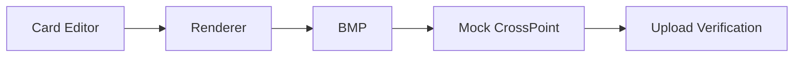

Verify:

* correct file name
* correct content type
* correct multipart field
* correct destination
* correct BMP dimensions
* correct BMP header

---

# 64. End-to-End Test

Playwright should simulate:

1. Open application.
2. Enter name.
3. Enter role.
4. Enable QR.
5. Select portrait.
6. Verify preview.
7. Mock `/api/status`.
8. Click Send.
9. Verify upload.
10. Display success state.

Repeat for landscape.

---

# 65. Accessibility

The application should support:

* keyboard navigation
* visible focus
* labels for all inputs
* accessible buttons
* sufficient contrast
* screen-reader-friendly status messages

Use:

```html
aria-live="polite"
```

for connection status and upload status.

---

# 66. Performance

Target:

```text
Initial JS: < 200 KB gzip
First render: < 1 second
Card generation: < 200 ms
```

No server-side image processing.

No unnecessary dependencies.

---

# 67. Offline Behavior

The application should continue working without internet access after loading.

The user should be able to:

```text
Open application
↓
Edit card
↓
Generate image
↓
Download image
```

The only network dependency for sending is:

```text
X3
```

---

# 68. PWA

A PWA should be considered for V1.

The user could install:

```text
X3 Card
```

on their phone's home screen.

This makes the workflow:

```text
Unlock phone
↓
Open X3 Card
↓
Edit
↓
Send
```

No browser navigation required.

---

# 69. Future PWA Architecture

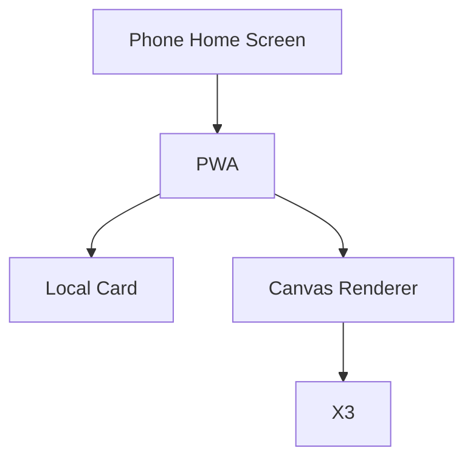

---

# 70. Future NFC Integration

NFC should be treated as a separate feature.

The e-ink image does not contain NFC data.

The X3's NFC implementation is independent of CrossPoint firmware according to CrossPoint community discussion.

Future application functionality could generate:

```text
vCard
```

for NFC programming.

However, NFC writing is outside the scope of this TDD.

---

# 71. Future Features

Potential V2 features:

* Multiple templates.
* Custom logos.
* Custom fonts.
* vCard QR.
* Direct NFC configuration.
* X4 support.
* Automatic device discovery.
* WebSocket upload.
* Upload history.
* Multiple saved cards.
* Shareable card configuration.
* PWA.
* Dark/light application UI while preserving e-ink preview.
* CrossPoint "open image" integration if exposed.
* Direct display API if added to CrossPoint.

---

# 72. Automatic Device Discovery

CrossPoint supports UDP discovery on port 8134.

The protocol is:

```text
Client → UDP 8134
hello

CrossPoint →
crosspoint (on <hostname>);81
```

However, browsers cannot directly perform arbitrary UDP discovery.

Therefore automatic UDP discovery should be implemented server-side if needed.

V1 should prefer:

```text
http://crosspoint.local
```

and manual IP fallback.

---

# 73. Recommended UX for Device Detection

Header:

```text
X3 CARD                         ● X3
```

Connected:

```text
● X3 CONNECTED
```

Connecting:

```text
◌ SEARCHING FOR X3
```

Disconnected:

```text
○ X3 OFFLINE
```

Wrong device:

```text
△ X4 DETECTED
```

---

# 74. Configuration Screen

A small advanced settings panel:

```text
DEVICE

Address
[ http://crosspoint.local ]

Transport
(o) HTTP
( ) WebSocket

Upload filename
[ business-card.bmp ]

[ TEST CONNECTION ]
```

Hide this by default.

The main interface should remain extremely simple.

---

# 75. Main Product Principle

The application should follow:

> **Design once. Preview exactly. Send directly.**

The user should not have to understand:

* BMP
* pixels
* e-ink resolutions
* CrossPoint APIs
* HTTP
* WebSockets

The technical complexity belongs behind the UI.

---

# 76. Ideal User Flow

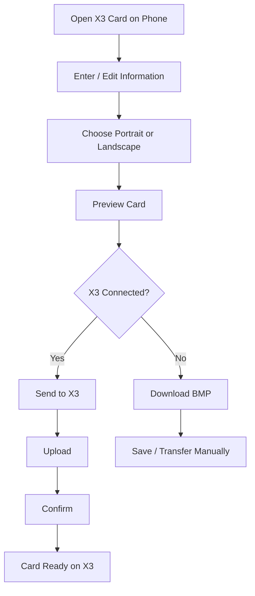

---

# 77. Acceptance Criteria

## Card generation

* [ ] User can enter name.
* [ ] User can enter role.
* [ ] User can enter company.
* [ ] User can enter contact information.
* [ ] User can configure QR code.
* [ ] User can select portrait.
* [ ] User can select landscape.
* [ ] Preview updates immediately.
* [ ] Generated image exactly matches preview.
* [ ] Portrait output is 528×792.
* [ ] Landscape output is 792×528.
* [ ] BMP is uncompressed 24-bit.

## X3 connectivity

* [ ] Application checks `http://crosspoint.local/api/status`.
* [ ] X3 is detected using `device === "X3"`.
* [ ] Connection state is visible.
* [ ] Failed connections do not crash the application.
* [ ] User can configure an IP fallback.

## X3 transfer

* [ ] User can send the generated BMP.
* [ ] Application uses `/upload`.
* [ ] Upload uses multipart form data.
* [ ] File is uploaded as `business-card.bmp`.
* [ ] Successful upload is clearly reported.
* [ ] Failed upload is clearly reported.
* [ ] WebSocket transport can be added without changing the UI.

## Mobile

* [ ] Fully responsive.
* [ ] Works on Safari iOS.
* [ ] Works on Chrome Android.
* [ ] No horizontal scrolling.
* [ ] Touch targets >= 44 px.
* [ ] Card preview remains readable.

## Deployment

* [ ] Application builds with Docker.
* [ ] Application starts using Docker Compose.
* [ ] Application can run without external services.
* [ ] No database required.
* [ ] No internet connection required after initial application load.

---

# 78. Implementation Phases

## Phase 1 — Foundation

* SvelteKit project.
* TypeScript.
* Docker.
* Basic e-ink UI.
* Responsive layout.

## Phase 2 — Card Renderer

* Card data model.
* Canvas renderer.
* Portrait.
* Landscape.
* Typography.
* BMP encoder.

## Phase 3 — Editor

* Form.
* Live preview.
* LocalStorage.
* QR code.

## Phase 4 — CrossPoint

* `/api/status`.
* Connection indicator.
* HTTP upload.
* Error handling.

## Phase 5 — Polish

* Mobile optimization.
* PWA.
* Accessibility.
* Golden image tests.
* Playwright tests.

## Phase 6 — Advanced

* WebSocket uploads.
* Automatic discovery.
* Multiple templates.
* X4 support.

---

# 79. Final Architecture

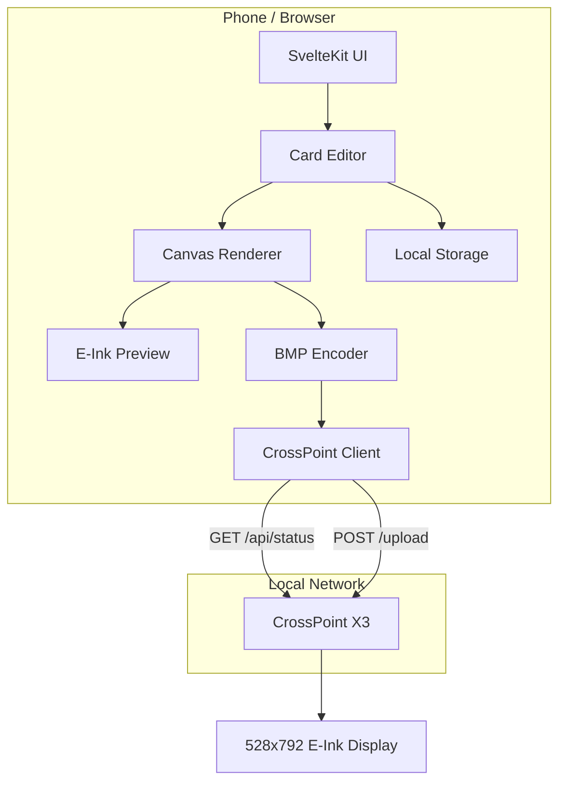

---

# 80. Key Technical Decision

The most important architectural decision is:

**Do not make the SvelteKit server responsible for generating the image.**

Generate the card entirely in the browser.

This gives the application:

* instant preview
* no backend image-processing service
* privacy
* offline operation
* excellent mobile support
* very simple Docker deployment

The SvelteKit server is essentially just the application shell.

The browser communicates directly with the X3 whenever possible.

---

# 81. CrossPoint Compatibility Note

CrossPoint is actively developed and currently supports both X3 and X4 hardware. Its documented wireless functionality includes HTTP file transfer, WebSocket uploads, WebDAV, settings APIs, and device status APIs.

The implementation should therefore isolate all CrossPoint-specific functionality behind `CrossPointClient`. This prevents the rest of the application from being coupled to CrossPoint's API and makes future firmware/API changes much easier to accommodate.

---

# 82. Definition of Done

The project is considered V1 complete when a user can:

```text
Open the web app on their phone
        ↓
Enter their name and job
        ↓
Choose portrait or landscape
        ↓
See exactly how the card will look
        ↓
Press "Send to X3"
        ↓
Application detects X3
        ↓
Application generates 528×792 BMP
        ↓
Application uploads it to CrossPoint
        ↓
User receives confirmation
```

with no command line, image editor, USB cable, manual image conversion, or account required.

